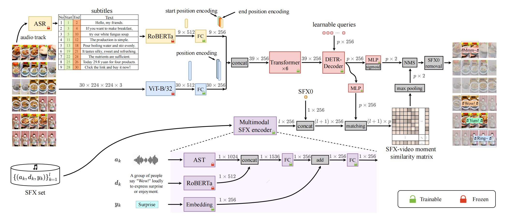

# D&M: Enriching E-commerce Videos with Sound Effects by Key Moment Detection and SFX Matching

The official source code of our AAAI25 paper "[D&M: Enriching E-commerce Videos with Sound Effects by Key Moment Detection and SFX Matching](https://arxiv.org/abs/2408.13226)".



## Environment

We used Anaconda to setup a deep learning workspace that supports PyTorch. Run the following script to install all the required packages.

```shell
conda create -n DM python==3.8 -y
conda activate DM
git clone https://github.com/adxcreative/D-M.git
cd D-M
pip install -r requirements.txt

mkdir save
cd save
mkdir loss
mkdir pretrain_model
mkdir train_model
cd ..
```

## Data

### Data download

The *SFX-Moment* dataset can be downloaded from [Google drive](https://drive.google.com/file/d/1J6fsKPjtj-8fssgyoJQSW9TiqP6OmO1r/view?usp=drive_link) or [Baidu drive](https://pan.baidu.com/s/1h3xFmKPtMkb9fsHZ1YYR8Q) (P: 9527).
Unzip the downloaded file in the root directory of the project.

### Data organization

The *SFX-Moment* dataset is organized in the following format:

```shell
SFX_Models
├── sfx
│   ├── wav_file
│   ├── sfx_info.csv
├── sfx_feat
│   ├── audio
│   ├── text
├── video
│   ├── asr
│   │   ├── train
│   │   ├── val
│   │   ├── test
│   ├── tts
│   │   ├── train
│   │   ├── val
│   │   ├── test
│   ├── km_tag1000.csv
│   ├── video_type.csv
│   ├── train_keymoment.csv
│   ├── val_keymoment.csv
│   ├── test_keymoment.csv
├── video_feat
│   ├── frame
│   │   ├── train
│   │   ├── val
│   │   ├── test
│   ├── asr
│   │   ├── train
│   │   ├── val
│   │   ├── test
│   ├── tts
│   │   ├── train
│   │   ├── val
│   │   ├── test
│   ├── text_sp.npy
├── train_video.txt
├── val_video.txt
├── test_video.txt
```

## Code

### Pre-training

The moment-SFX matching (MSM) based pre-training can be launched by running the following command:

```shell
bash do_pretrain.sh
```

### Training

The training can be launched by running the following command:

```shell
bash do_train.sh
```

### Evaluation
The evaluation od test set can be launched by running the following command:

```shell
bash do_eval.sh
```

## Acknowledgments

Codes are based on resources from [Chinese-CLIP](https://github.com/OFA-Sys/Chinese-CLIP) and [Moment-DETR](https://github.com/jayleicn/moment_detr) . Thanks for their great work.

## Citation

If you find our method useful in your work, please cite:

```python
@inproceedings{liu2024d,
  title ={D&M: Enriching E-commerce Videos with Sound Effects by Key Moment Detection and SFX Matching},
  author ={Liu, Jingyu and Wang, Minquan and Ma, Ye and Wang, Bo and Chen, Aozhu and Chen, Quan and Jiang, Peng and Li, Xirong},
  booktitle ={Proceedings of the AAAI Conference on Artificial Intelligence(AAAI)},
  year={2025}
}
```

## Contact

If you have any questions, please raise an issue or contact us at Jingyu Liu ([liujingyu2023@ruc.edu.cn](mailto:liujingyu2023@ruc.edu.cn))

## LICENSE

The *SFX-Moment* dataset are under [CC BY-NC-ND 4.0](https://creativecommons.org/licenses/by-nc-nd/4.0/) license, see [DATA-LICENSE](./DATA-LICENSE). All the code are under [MIT](https://opensource.org/licenses/MIT) license, see [LICENSE](./LICENSE).


